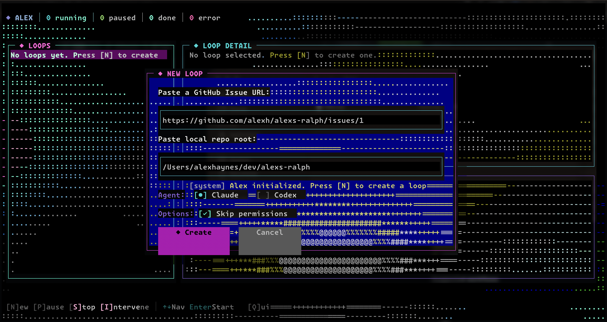

# ALEx

**A**nother **L**oop **Ex**perience


TUI for running multiple AI coding agents in parallel. Point it at GitHub issues, let Claude or Codex do the work.

Inspired by [ralph-claude-code](https://github.com/frankbria/ralph-claude-code) but without the strict project structure requirements, and with support for multiple agents.



## What it does

- Spawn agent loops from GitHub issue URLs
- Parse acceptance criteria from issue markdown
- Live transcript streaming
- Pause/resume/stop loops (SIGSTOP/SIGCONT/SIGTERM)
- Send interventions to agent stdin mid-task
- Persists state across sessions

## Install

Requires [Bun](https://bun.sh), [GitHub CLI](https://cli.github.com/) authenticated, and at least one agent CLI installed.

```bash
bun install && bun run build && bun link
```

Then run from any repo:

```bash
cd ~/your-project
alex
```

## Usage

| Key | Action |
|-----|--------|
| `N` | New loop (paste GH issue URL) |
| `Enter` | Start queued loop |
| `P` | Pause/Resume |
| `S` | Stop |
| `I` | Intervene (send message to agent) |
| `↑↓` | Navigate loops |
| `Q` | Quit |

## Agents

ALEx uses a YAML-based adapter system—any CLI agent can be integrated by defining a config file.

**Built-in adapters:**
- `claude` — Anthropic Claude Code
- `codex` — OpenAI Codex CLI

**Custom adapters:** Drop a YAML file in `~/.alex/adapters/` or `./.alex/adapters/`. See `examples/adapters/` for templates.

```yaml
name: my-agent
command: my-agent-cli
spawn:
  args: ["-p", "{{prompt}}"]
continue:
  args: ["--resume", "{{sessionId}}", "-p", "{{prompt}}"]
sessionExtraction:
  patterns: ['"session":\\s*"([^"]+)"']
```

Agents run in the repo directory you specify. Completion detected via `<promise>TASK COMPLETE</promise>` tag.

## Data

State and logs stored in `./data/`:
- `state.json` - loop metadata
- `loops/{id}/log.jsonl` - transcript per loop
